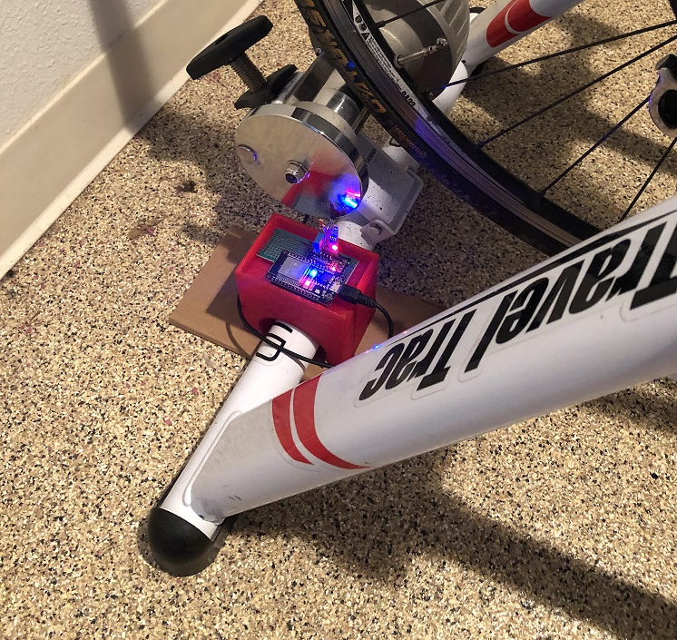
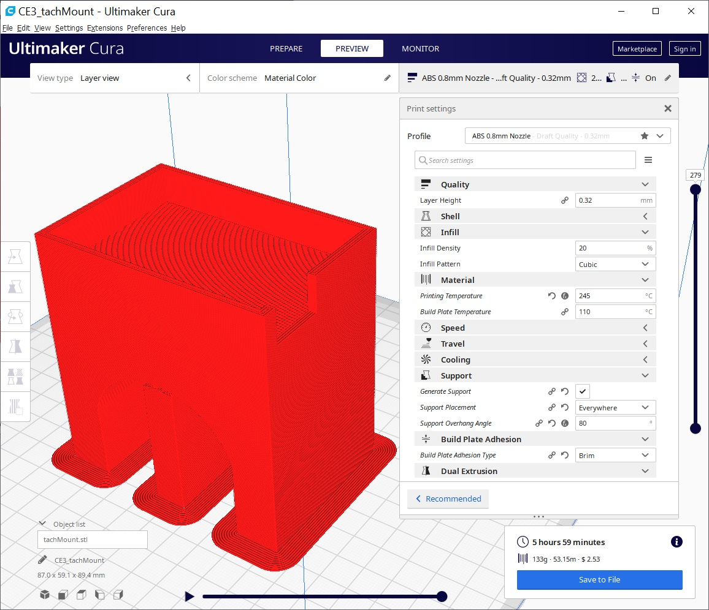

# esp32-ftms-server

 This is an ESP-32 based tachometer that I built for my stationary bike stand.  It uses the [Indoor Bike Data characteristic](https://www.bluetooth.com/wp-content/uploads/Sitecore-Media-Library/Gatt/Xml/Characteristics/org.bluetooth.characteristic.indoor_bike_data.xml) of the FTMS BLE service.

## Parts List

* [MELIFE 2 Pack for ESP32](https://www.amazon.com/MELIFE-Development-Dual-Mode-Microcontroller-Integrated/dp/B07Q576VWZ/ref=sr_1_1?dchild=1&keywords=MELIFE+2+Pack+for+ESP32+ESP-32S+Development+Board+2.4GHz+Dual-Mode&qid=1619282031&s=electronics&sr=1-1)
* [ELEGOO 32 Pcs Double Sided PCB Board Prototype Kit](https://www.amazon.com/ELEGOO-Prototype-Soldering-Compatible-Arduino/dp/B072Z7Y19F/ref=sr_1_1?dchild=1&keywords=ELEGOO+32+Pcs+Double+Sided+PCB+Board+Prototype+Kit+for+DIY+Soldering+with+5+Sizes+Compatible+with+Arduino+Kits&qid=1619282054&s=industrial&sr=1-1)
* [ELEGOO Upgraded 37 in 1 Sensor Modules Kit](https://www.amazon.com/ELEGOO-Upgraded-Tutorial-Compatible-MEGA2560/dp/B01MG49ZQ5/ref=sr_1_1?dchild=1&keywords=ELEGOO+Upgraded+37+in+1+Sensor+Modules+Kit+with+Tutorial+Compatible+with+Arduino+IDE+UNO+R3+MEGA2560+Nano&qid=1619282073&s=electronics&sr=1-1)
* [HATCHBOX ABS 3D Printer Filament](https://www.amazon.com/HATCHBOX-3D-Filament-Dimensional-Transparent/dp/B00M0CS6HA/ref=sr_1_4?dchild=1&keywords=Hatchbox+ABS&qid=1619282235&s=electronics&sr=1-4-catcorr)

## 3d Print Settings

The Cura 3d print settings for the tachMount.stl are below:

